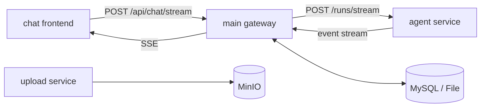

<p align="right">
  <a href="./README.zh-CN.md">中文</a> |
  <a href="./README.en.md">English</a>
</p>

<p align="center">
  
</p>

<h1 align="center">MyAiChat</h1>

<p align="center">
  A multi-service AI chat system for production chat scenarios (Chat + Gateway + Agent + Upload)
</p>

<p align="center">
  
  
  
  
</p>

## Highlights

- Clerk authentication with user-level data isolation
- OpenAI-compatible model integration
- SSE streaming output with normalized events
- Multi-agent collaboration (moderator / researcher / numeric / answerer / ui / memory)
- Dynamic structured memory (configurable schema)
- Dual storage drivers: `file` / `mysql`
- Dedicated upload service (MinIO)

## Architecture Overview



## Project Structure

```text
.
├─ chat/                  # Vue 3 + Vite + TS frontend
├─ main/                  # Node.js + Express API gateway
├─ agent/                 # Python FastAPI + LangGraph agent service
├─ upload/                # Node.js upload service (MinIO)
├─ tools/console-manager/ # Chinese-friendly console management platform
├─ docker-compose.yml
└─ .env.example
```

## Requirements

- Node.js: `^20.19.0` or `>=22.12.0`
- Frontend package manager: `pnpm`
- Backend package manager: `npm`
- Python: `3.12+`
- Docker (optional)
- A valid Clerk app (required)

## Console-Based Local Start (Recommended)

1. Prepare environment files

```bash
cp .env.example .env
cp main/.env.example main/.env
cp chat/.env.example chat/.env
cp upload/.env.example upload/.env
```

2. Install dependencies

```bash
cd main && npm install
cd ../chat && pnpm install
cd ../upload && npm install
cd ../agent && python -m pip install -r requirements.txt
```

3. Initialize config files and launch the console manager

```bash
npm run console:init-config
npm run console
```

Inside the console manager you can:

- start all `chat/main/agent/upload` services
- use a guided config wizard for required and optional settings
- batch start, restart, or stop selected service roles
- edit grouped `.env` configuration in Chinese prompts
- run config validation and inspect recent logs

4. Access URLs

- chat: `http://localhost:5173`
- main: `http://127.0.0.1:3000`
- agent: `http://127.0.0.1:8000`
- upload: `http://127.0.0.1:3001`

## Docker Startup

```bash
docker compose up --build
```

Default ports: chat `8080`, main `3000`, mysql `3306`, minio `9000/9001`, upload `3001`.

## Common Development Commands

### chat

```bash
cd chat
pnpm dev
pnpm type-check
pnpm test:unit --run
pnpm test:e2e
pnpm build
pnpm lint
pnpm spell:check
```

### main

```bash
cd main
npm run dev
npm run migrate
npm run spell:check
```

### upload

```bash
cd upload
npm run dev
```

### console manager (manage chat/main/agent/upload)

```bash
npm run console
npm run console:start
npm run console:status
npm run console:stop
npm run console:restart
npm run console:wizard-config
npm run console:config-check
npm run console:init-config
```

Config entry points:

- `console:init-config`: create missing `.env` files only
- `console:wizard-config`: guided Chinese wizard for required settings, then optional settings
- interactive `管理配置分组`: targeted edits for one config category at a time

## Key Configuration

- `STORAGE_DRIVER`: `file` / `mysql` (`main`)
- `AGENT_STORAGE_DRIVER`: `file` / `mysql` (`agent`)
- `AGENT_SERVICE_URL`: `main -> agent` endpoint
- `DB_*`: MySQL connection variables
- `CLERK_SECRET_KEY` / `VITE_CLERK_PUBLISHABLE_KEY`: auth config

After enabling MySQL mode, run migration first:

```bash
cd main && npm run migrate
```

## API Entry Points (main)

- Model configs: `/api/model-configs`
- Sessions: `/api/sessions`
- Robots: `/api/robots`
- Streaming chat: `POST /api/chat/stream`

## Debugging Tips

- Verify chain in order: `agent /health` -> `main API` -> `chat SSE`
- Start with `file` mode first to isolate DB issues
- Focus logs on `main`, `agent`, and browser Network SSE events

## UI Preview

### Desktop

<div align="center">
  <table>
    <tr>
      <td align="center" width="50%"></td>
      <td align="center" width="50%"></td>
    </tr>
    <tr>
      <td align="center" width="50%"></td>
      <td align="center" width="50%"></td>
    </tr>
    <tr>
      <td align="center" width="50%"></td>
      <td align="center" width="50%"></td>
    </tr>
  </table>
</div>

### Mobile

<div align="center">
  <table>
    <tr>
      <td align="center" width="50%"></td>
      <td align="center" width="50%"></td>
    </tr>
    <tr>
      <td align="center" width="50%"></td>
      <td align="center" width="50%"></td>
    </tr>
  </table>
</div>

## Related Documents

- [README.md](./README.md)
- [README.zh-CN.md](./README.zh-CN.md)
- [DATABASE_DOCKER_SETUP.zh-CN.md](./DATABASE_DOCKER_SETUP.zh-CN.md)
- [TASK_CHECKLIST.md](./TASK_CHECKLIST.md)
- [TASK_CHECKLIST.en.md](./TASK_CHECKLIST.en.md)
- [TASK_CHECKLIST.zh-CN.md](./TASK_CHECKLIST.zh-CN.md)
