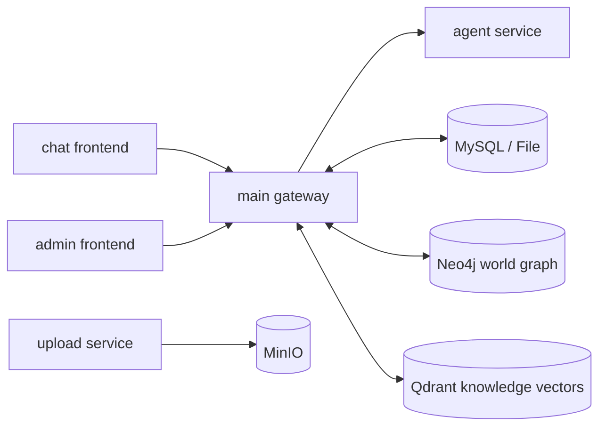
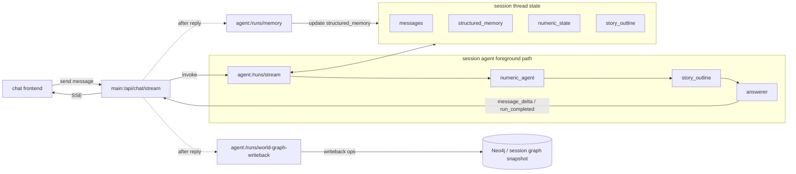

<p align="right">
  <a href="./README.zh-CN.md">中文</a> |
  <a href="./README.en.md">English</a>
</p>

<p align="center">
  
</p>

<h1 align="center">MyAiChat</h1>

<p align="center">
  A multi-service AI chat system for production chat scenarios (Chat + Gateway + Agent + Upload + Admin)
</p>

<p align="center">
  
  
  
  
</p>

## Overview

MyAiChat is not just a single chat page. It is a full workspace for building AI chat products:

- `chat` provides the end-user Vue 3 chat UI
- `main` handles model configs, sessions, streaming orchestration, admin APIs, and persistence
- `agent` handles multi-agent reasoning, structured memory, story outlines, and world-graph writeback
- `upload` handles image uploads backed by MinIO
- `admin` provides the back-office frontend on top of `main`'s `/admin-api`
- `tools/console-manager` provides a Chinese-friendly local control console

<div align="center">
  
</div>

## Recent Core Capabilities

These capabilities are reflected in the recent commit history and current main code paths:

- Clerk authentication with user-level data isolation
- OpenAI-compatible and Ollama model integration
- SSE streaming with normalized frontend events
- Agent execution chain: foreground `numeric -> story_outline -> answerer`, background `memory -> world_graph_writeback`
- Externalized prompt configuration for the agent service
- Dynamic structured memory with configurable schema
- Session-level `story outline` generation and persistence
- Robot world-graph editor with timeline, relation types, node/edge editing, and auto layout
- Session mirror world-graph viewer during chat
- Agent template import and export
- Unified server-side chat persistence, outline handling, and world-graph writeback
- Document import, robot generation tasks, vector knowledge retrieval (`Qdrant`), and graph storage (`Neo4j`)
- Dual storage drivers: `file` / `mysql`
- Dedicated upload service with MinIO
- Admin back office and console management tooling

## Architecture



- `chat` renders the conversation UI and streaming messages.
- `main` owns the unified API layer, session persistence, SSE forwarding, and background task scheduling.
- `agent` generates replies, structured memory, story outlines, and graph writeback operations.
- `upload` handles file uploads backed by `MinIO`.

### Session Agent Architecture



- Foreground path: `chat -> main:/api/chat/stream -> agent:/runs/stream -> numeric_agent -> story_outline -> answerer -> main -> chat`
- `numeric_agent` updates the session numeric state for downstream nodes.
- `story_outline` generates the internal outline for the current turn and feeds it into answer generation.
- `answerer` streams the final user-visible response, and `main` forwards it as SSE.
- After the main reply completes, `main` asynchronously triggers `memory` and `world_graph_writeback`.
- The session thread state keeps `messages / structured_memory / numeric_state / story_outline` for the next turn.

## Project Structure

```text
.
├─ chat/                  # Vue 3 + Vite + TS chat frontend
├─ main/                  # Node.js + Express gateway / API / admin endpoints
├─ agent/                 # Node.js + Express + LangGraph agent service
├─ upload/                # Node.js upload service (MinIO)
├─ admin/                 # Vue 3 admin frontend
├─ docs/                  # supplementary docs
├─ tools/console-manager/ # local console manager
├─ docker-compose.yml
└─ .env.example
```

## Requirements

- Node.js: `^20.19.0` or `>=22.12.0`
- pnpm: `>=9` for `chat` and `admin`
- `npm` for `main`, `agent`, and `upload`
- Docker / Docker Compose for integrated local runs
- A valid Clerk application
- `Qdrant` and `Neo4j` if you enable knowledge retrieval and world graph features

## Local Startup

### Option 1: Console Manager (recommended)

1. Prepare environment files

```bash
cp .env.example .env
cp main/.env.example main/.env
cp chat/.env.example chat/.env
cp agent/.env.example agent/.env
cp upload/.env.example upload/.env
cp admin/.env.example admin/.env
```

2. Install dependencies

```bash
cd main && npm install
cd ../chat && pnpm install
cd ../agent && npm install
cd ../upload && npm install
cd ../admin && pnpm install
```

3. Initialize config files and launch the console

```bash
npm run console:init-config
npm run console
```

The console can:

- start `chat/main/agent/upload/admin`
- guide you through required `.env` values
- edit grouped config items and write them back to files
- batch restart or stop services
- run config checks and show log summaries

### Option 2: Start services manually

```bash
cd main && npm install && npm run dev
cd chat && pnpm install && pnpm dev
cd upload && npm install && npm run dev
cd admin && pnpm install && pnpm dev
cd agent && npm install && npm run dev
```

If you use MySQL storage, run migrations first:

```bash
cd main && npm run migrate
```

## Local Development URLs

- chat: `http://localhost:5173`
- main: `http://127.0.0.1:3000`
- agent: `http://127.0.0.1:8000`
- upload: `http://127.0.0.1:3001`
- admin: `http://127.0.0.1:8081`
- admin-api: `http://127.0.0.1:3000/admin-api`

## Docker Startup

```bash
docker compose up --build
```

Default exposed services:

- `chat`: `8080`
- `main`: `3000`
- `admin`: `8081`
- `upload`: `3001`
- `agent`: internal container service on `8000`, not exposed directly to the host
- `mysql`: `3306`
- `minio`: `9000/9001`
- `neo4j`: `7474/7687`
- `qdrant`: `6333/6334`

## Common Development Commands

### chat

```bash
cd chat
pnpm dev
pnpm type-check
pnpm test:unit --run
pnpm test:e2e
pnpm build
pnpm lint
pnpm spell:check
```

### main

```bash
cd main
npm run dev
npm run migrate
npm run spell:check
```

### agent

```bash
cd agent
npm install
npm run dev
```

### upload

```bash
cd upload
npm run dev
```

### admin

```bash
cd admin
pnpm dev
pnpm build
pnpm typecheck
pnpm lint
```

### console manager

```bash
npm run console
npm run console:start
npm run console:status
npm run console:stop
npm run console:restart
npm run console:install-env
npm run console:wizard-config
npm run console:config-check
npm run console:init-config
```

## Key Configuration

### root `.env`

- `PORT`: `main` service port
- `CHAT_PORT` / `ADMIN_PORT` / `UPLOAD_PORT`: Docker-exposed ports
- `CLERK_SECRET_KEY` / `CLERK_PUBLISHABLE_KEY` / `VITE_CLERK_PUBLISHABLE_KEY`: auth
- `VITE_ADMIN_API_BASE_URL` / `ADMIN_API_BASE_URL`: admin frontend and backend URLs
- `JWT_SECRET` / `JWT_ALGO`: admin API auth

### `main/.env`

- `STORAGE_DRIVER`: `file` / `mysql`
- `AGENT_SERVICE_URL`: `main -> agent`
- `DB_*`: MySQL connection
- `NEO4J_*`: world graph storage
- `QDRANT_*`: knowledge vector store
- `KNOWLEDGE_EMBEDDING_*`: embedding model settings
- `ROBOT_IMPORT_MAX_FILE_SIZE_MB`: document import limit
- `ROBOT_GENERATION_CONCURRENCY`: robot generation concurrency

### `agent/.env`

- `AGENT_STORAGE_DRIVER`: `file` / `mysql`
- `DB_*`: database connection when MySQL mode is enabled
- `AGENT_FILE_STORE_DIR`: thread-state directory when file mode is enabled
- `AGENT_DEBUG_LOGS`: enable verbose agent debug logs

### `upload/.env`

- `MINIO_*`: object storage config
- `UPLOAD_MAX_FILE_SIZE_MB`: upload size limit

## Main API Surface

### `main`

- Model configs: `/api/model-configs`, `/api/model-config`
- Capability discovery: `/api/models`, `/api/capabilities`
- Sessions: `/api/sessions`
- Robots: `/api/robots`
- Robot generation tasks: `/api/robots/generation-tasks`
- World graph: `/api/robots/:id/world-graph/*`
- Streaming chat: `POST /api/chat/stream`
- Admin endpoints: `/admin-api/*`

### `agent`

- Health: `GET /health`
- Streaming run: `POST /runs/stream`
- Structured memory: `POST /runs/memory`
- World-graph writeback: `POST /runs/world-graph-writeback`
- Document summary / generation helpers: `POST /runs/document-summary`

### `upload`

- Health: `GET /health`
- Image upload: `POST /api/upload/image`

## Debugging Notes

- Check the pipeline in order: `agent /health` -> `main API` -> `chat SSE`
- Start with `file` mode if you want to isolate DB issues
- For world-graph issues, inspect `Neo4j` and `main` logs first
- For knowledge retrieval issues, inspect `Qdrant`, `KNOWLEDGE_EMBEDDING_*`, and model availability
- If admin login fails, confirm `main` finished admin seed initialization

## Related Documents

- [README.md](./README.md)
- [README.zh-CN.md](./README.zh-CN.md)
- [chat/README.md](./chat/README.md)
- [admin/README.md](./admin/README.md)
- [DATABASE_DOCKER_SETUP.zh-CN.md](./DATABASE_DOCKER_SETUP.zh-CN.md)
- [TASK_CHECKLIST.md](./TASK_CHECKLIST.md)
- [TASK_CHECKLIST.en.md](./TASK_CHECKLIST.en.md)
- [TASK_CHECKLIST.zh-CN.md](./TASK_CHECKLIST.zh-CN.md)
