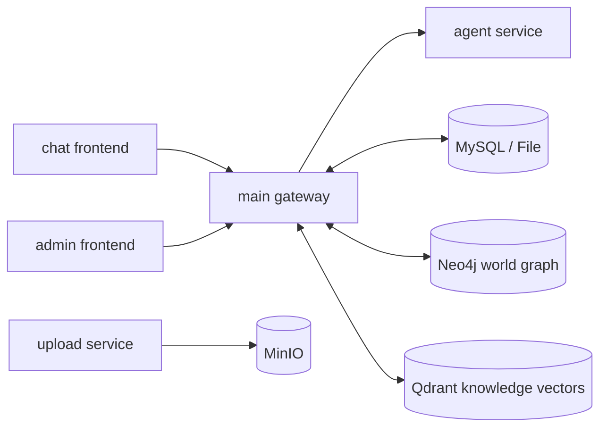
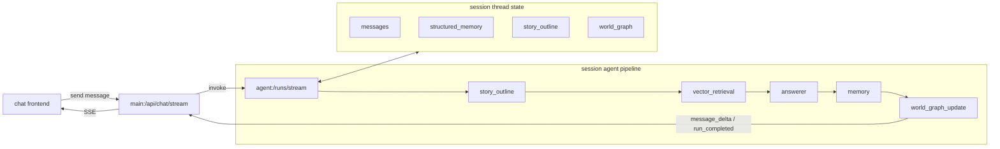

<p align="right">
  <a href="./README.zh-CN.md">中文</a> |
  <a href="./README.en.md">English</a>
</p>

<p align="center">
  
</p>

<h1 align="center">MyAiChat Realistic World Interaction</h1>

<p align="center">
  
  
  
  
  
</p>

## Important Note

I am currently maintaining this project alone and the workload is getting hard to keep up with. If you would like to join or contribute, feel free to contact me:
[Email: q19946502@gmail.com](mailto:q19946502@gmail.com)  
[WeChat: zr19946502](https://weixin.qq.com/u/zr19946502)  
If you have ideas or find bugs, please open an issue and I will reply as soon as I can.
I also want to explicitly recognize and thank the LINUX DO community for helping foster an open culture of technical exchange and sharing.
Thank you for the support.

## Overview

MyAiChat is built toward a more realistic world-interaction API platform and a more immersive conversation experience. The project is continuing to evolve in three directions:

- Use different agents to make story and world generation more controllable
- Turn character nodes that appear in a scene into independent agents for autonomous interaction and world evolution
- Support multi-user, multi-agent group experiences such as tabletop sessions, cooperative missions, and role-based interaction where an agent can act as a DM or as a user role

This aims to create a new way of reading and participating. Instead of cold, passive, single-user reading, users can enter the story directly and every character can keep its own narrative line. The long-term direction is to move from a traditional linear flow toward tree-structured interactive reading.

## Project Description

MyAiChat is not a single chat page. It is a full workspace built around realistic interactive dialogue:

- `chat` can be used to configure agents, models, and related settings, then connect through APIs to personal or company software, or be used directly for online conversation
- `main` handles model configs, sessions, streaming orchestration, admin APIs, and persistence
- `agent` handles reply generation, long/short-term memory updates, story-draft generation, and unified world-graph updates
- `upload` handles image uploads backed by MinIO
- `admin` provides the back-office frontend on top of `main`'s `/admin-api`
- `tools/console-manager` provides a Chinese-friendly local control console

<div align="center">
  
</div>

## Recent Core Capabilities

These capabilities are reflected in the recent commit history and current main code paths:

- Clerk authentication with user-level data isolation
- OpenAI-compatible and Ollama model integration
- SSE streaming with normalized frontend events
- Agent execution chain: `story_outline -> vector_retrieval -> answerer -> memory -> world_graph_update`
- Externalized prompt configuration for the agent service
- Fixed long-term / short-term memory updates on every turn
- Session-level structured `story outline` draft generation and persistence
- Agent world-graph editor with timeline, relation types, node/edge editing, and auto layout
- Session mirror world-graph viewer during chat
- Agent template import and export
- Unified server-side chat persistence, story draft handling, synchronous memory updates, and unified world-graph updates
- The main driver has shifted from “structured-memory-driven” to “graph-driven”:
  the world graph is now the primary fact source for next-turn progression and state continuity, while long/short-term memory acts as compressed summary context
- Document import, agent generation tasks, vector knowledge retrieval (`Qdrant`), and graph storage (`Neo4j`)
- Dual storage drivers: `file` / `mysql`
- Dedicated upload service with MinIO
- Admin back office and console management tooling

## Recent Main Work

- Improve the performance of different agents and increase dialogue efficiency
- Optimize token usage and reduce cost
- Add generation by story line support; the current mode focuses on continuation along a story line
- Improve the overall UI, world-graph presentation, and mobile adaptation
- Improve token statistics
- Add and remove agent modules to make the agent pipeline more configurable

## Architecture



- `chat` renders the conversation UI and streaming messages.
- `main` owns the unified API layer, session persistence, SSE forwarding, retrieval orchestration, and synchronous post-processing.
- `agent` generates story drafts, final replies, memory updates, and unified world-graph patches.
- `upload` handles file uploads backed by `MinIO`.

### Session Agent Architecture



- Main path: `chat -> main:/api/chat/stream -> story_outline -> GraphRAG draft assist -> vector retrieval -> answerer -> memory -> world_graph_update -> chat`
- `story_outline` generates structured `story_draft + retrieval_query` for downstream generation and retrieval.
- GraphRAG only assists the story draft and does not enter the answer context directly.
- The answer context uses story setting, long/short-term memory, story draft, vector retrieval output, the latest turn, and the current user input.
- `memory` synchronously updates long-term and short-term memory every turn.
- `world_graph_update` completes two jobs in one model call:
  it writes content that actually happened in the answer into the session graph, and evolves graph content that was not directly written out in the answer.
- Objects, relations, and events explicitly written in the answer are resolved by the answer itself and are not sent into a second evolution pass.
- The current session path is now graph-driven rather than structured-memory-driven.
  Long/short-term memory compresses identity, recent status, and task summaries, while the world graph carries world-state progression, event timelines, and relation changes.
- The session thread state keeps `messages / structured_memory / story_outline / world_graph` for the next turn.

## Project Structure

```text
.
├─ chat/                  # Vue 3 + Vite + TS chat frontend
├─ main/                  # Node.js + Express gateway / API / admin endpoints
├─ agent/                 # Node.js + Express + LangGraph agent service
├─ upload/                # Node.js upload service (MinIO)
├─ admin/                 # Vue 3 admin frontend
├─ docs/                  # supplementary docs
├─ tools/console-manager/ # local console manager
├─ docker-compose.yml
└─ .env.example
```

## Requirements

- Node.js: `^20.19.0` or `>=22.12.0`
- pnpm: `>=9` for `chat` and `admin`
- `npm` for `main`, `agent`, and `upload`
- Docker / Docker Compose for integrated local runs
- A valid Clerk application
- If you want `linux.do` login, configure it in Clerk as an external identity provider
- `Qdrant` and `Neo4j` if you enable knowledge retrieval and world graph features

## Local Startup

### Option 1: Console Manager (recommended)

1. Prepare environment files

```bash
cp .env.example .env
cp main/.env.example main/.env
cp chat/.env.example chat/.env
cp agent/.env.example agent/.env
cp upload/.env.example upload/.env
cp admin/.env.example admin/.env
```

2. Install dependencies

```bash
cd main && npm install
cd ../chat && pnpm install
cd ../agent && npm install
cd ../upload && npm install
cd ../admin && pnpm install
```

3. Initialize config files and launch the console

```bash
npm run console:init-config
npm run console
```

The console can:

- start `chat/main/agent/upload/admin`
- guide you through required `.env` values
- edit grouped config items and write them back to files
- batch restart or stop services
- run config checks and show log summaries

### Option 2: Start services manually

```bash
cd main && npm install && npm run dev
cd chat && pnpm install && pnpm dev
cd upload && npm install && npm run dev
cd admin && pnpm install && pnpm dev
cd agent && npm install && npm run dev
```

If you use MySQL storage, run migrations first:

```bash
cd main && npm run migrate
```

## Local Development URLs

- chat: `http://localhost:5173`
- main: `http://127.0.0.1:3000`
- agent: `http://127.0.0.1:8000`
- upload: `http://127.0.0.1:3001`
- admin: `http://127.0.0.1:8081`
- admin-api: `http://127.0.0.1:3000/admin-api`

## Docker Startup

```bash
docker compose up --build
```

Default exposed services:

- `chat`: `8080`
- `main`: `3000`
- `admin`: `8081`
- `upload`: `3001`
- `agent`: internal container service on `8000`, not exposed directly to the host
- `mysql`: `3306`
- `minio`: `9000/9001`
- `neo4j`: `7474/7687`
- `qdrant`: `6333/6334`

## Common Development Commands

### chat

```bash
cd chat
pnpm dev
pnpm type-check
pnpm test:unit --run
pnpm test:e2e
pnpm build
pnpm lint
pnpm spell:check
```

### main

```bash
cd main
npm run dev
npm run migrate
npm run spell:check
```

### agent

```bash
cd agent
npm install
npm run dev
```

### upload

```bash
cd upload
npm run dev
```

### admin

```bash
cd admin
pnpm dev
pnpm build
pnpm typecheck
pnpm lint
```

### console manager

```bash
npm run console
npm run console:start
npm run console:status
npm run console:stop
npm run console:restart
npm run console:install-env
npm run console:wizard-config
npm run console:config-check
npm run console:init-config
```

## Key Configuration

### root `.env`

- `PORT`: `main` service port
- `CHAT_PORT` / `ADMIN_PORT` / `UPLOAD_PORT`: Docker-exposed ports
- `CLERK_SECRET_KEY` / `CLERK_PUBLISHABLE_KEY` / `VITE_CLERK_PUBLISHABLE_KEY`: auth, including `linux.do` login through Clerk
- `VITE_ADMIN_API_BASE_URL` / `ADMIN_API_BASE_URL`: admin frontend and backend URLs
- `JWT_SECRET` / `JWT_ALGO`: admin API auth

### Clerk with `linux.do`

1. Enable `linux.do` as an external identity provider in the Clerk Dashboard and fill in its Client ID and Client Secret.
2. Add `http://localhost:5173` and your production frontend domain to Clerk allowed origins, sign-in callbacks, and sign-out callbacks.
3. Keep the current frontend login button unchanged. Users still open the Clerk modal, and Clerk renders the `linux.do` entry there.
4. After login, `chat` continues to call `main` and `upload` with Clerk tokens. No project-local OAuth endpoint is added.
5. If `linux.do` does not appear in the Clerk modal, first verify the provider is enabled, callback domains match, and the frontend is using the correct Clerk publishable key.

### `main/.env`

- `STORAGE_DRIVER`: `file` / `mysql`
- `AGENT_SERVICE_URL`: `main -> agent`
- `DB_*`: MySQL connection
- `NEO4J_*`: world graph storage
- `QDRANT_*`: knowledge vector store
- `KNOWLEDGE_EMBEDDING_*`: embedding model settings
- `ROBOT_IMPORT_MAX_FILE_SIZE_MB`: document import limit
- `ROBOT_GENERATION_CONCURRENCY`: agent generation concurrency

### `agent/.env`

- `AGENT_STORAGE_DRIVER`: `file` / `mysql`
- `DB_*`: database connection when MySQL mode is enabled
- `AGENT_FILE_STORE_DIR`: thread-state directory when file mode is enabled
- `AGENT_DEBUG_LOGS`: enable verbose agent debug logs

### `upload/.env`

- `MINIO_*`: object storage config
- `UPLOAD_MAX_FILE_SIZE_MB`: upload size limit

## Main API Surface

### `main`

- Model configs: `/api/model-configs`, `/api/model-config`
- Capability discovery: `/api/models`, `/api/capabilities`
- Sessions: `/api/sessions`
- Agents: `/api/robots`
- Agent generation tasks: `/api/robots/generation-tasks`
- World graph: `/api/robots/:id/world-graph/*`
- Streaming chat: `POST /api/chat/stream`
- Admin endpoints: `/admin-api/*`

### `agent`

- Health: `GET /health`
- Streaming run: `POST /runs/stream`
- Structured memory: `POST /runs/memory`
- World-graph writeback: `POST /runs/world-graph-writeback`
- Document summary / generation helpers: `POST /runs/document-summary`

### `upload`

- Health: `GET /health`
- Image upload: `POST /api/upload/image`

## Debugging Notes

- Check the pipeline in order: `agent /health` -> `main API` -> `chat SSE`
- Start with `file` mode if you want to isolate DB issues
- For world-graph issues, inspect `Neo4j` and `main` logs first
- For knowledge retrieval issues, inspect `Qdrant`, `KNOWLEDGE_EMBEDDING_*`, and model availability
- If admin login fails, confirm `main` finished admin seed initialization
