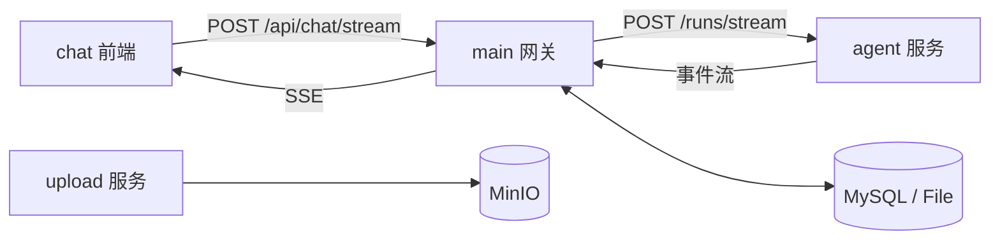
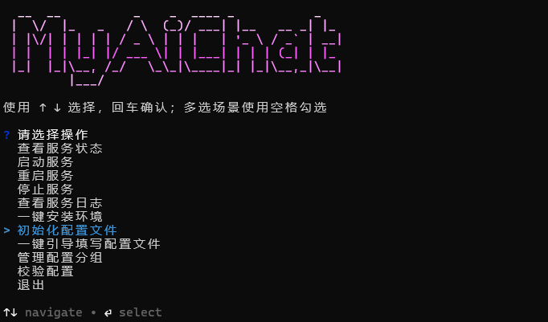

<p align="right">
  <a href="./README.md">中文</a> |
  <a href="./README.en.md">English</a>
</p>

<p align="center">
  
</p>

<h1 align="center">MyAiChat</h1>

<p align="center">
  面向聊天产品场景的多服务 AI 对话系统（Chat + Gateway + Agent + Upload）
</p>

<p align="center">
  
  
  
  
</p>

## 项目亮点

- Clerk 登录鉴权与用户级数据隔离
- OpenAI-compatible 模型接入
- SSE 流式输出与事件归一化
- 多智能体协作（moderator / researcher / numeric / answerer / ui / memory）
- 动态结构化记忆（Schema 可配置）
- `file` / `mysql` 双存储驱动
- 独立上传服务（MinIO）

## 架构总览



## 项目结构

```text
.
├─ chat/                  # Vue 3 + Vite + TS 前端
├─ main/                  # Node.js + Express API 网关
├─ agent/                 # Python FastAPI + LangGraph 智能体
├─ upload/                # Node.js 上传服务（MinIO）
├─ tools/console-manager/ # 中文控制台管理平台
├─ docker-compose.yml
└─ .env.example
```

## 运行要求

- Node.js：`^20.19.0` 或 `>=22.12.0`
- 前端包管理：`pnpm`
- 后端包管理：`npm`
- Python：`3.12+`
- Docker（可选）
- 可用 Clerk 应用（必需）

## 控制台本地启动（推荐）

1. 准备环境变量

```bash
cp .env.example .env
cp main/.env.example main/.env
cp chat/.env.example chat/.env
cp upload/.env.example upload/.env
```

2. 安装依赖

```bash
cd main && npm install
cd ../chat && pnpm install
cd ../upload && npm install
cd ../agent && python -m pip install -r requirements.txt
```

3. 初始化配置并启动控制台管理平台

```bash
npm run console:init-config
npm run console
```

进入平台后可直接：

- 全部启动 `chat/main/agent/upload`
- 使用一键配置向导顺序填写关键项与可选项
- 按服务功能位批量启动、重启、停止
- 按分组编辑 `.env` 配置并同步写回
- 执行配置校验并查看日志摘要

控制台演示：

<p align="center">
  
</p>

4. 访问地址

- chat：`http://localhost:5173`
- main：`http://127.0.0.1:3000`
- agent：`http://127.0.0.1:8000`
- upload：`http://127.0.0.1:3001`

## Docker 启动

```bash
docker compose up --build
```

默认端口：chat `8080`，main `3000`，mysql `3306`，minio `9000/9001`，upload `3001`。

## 常用开发命令

### chat

```bash
cd chat
pnpm dev
pnpm type-check
pnpm test:unit --run
pnpm test:e2e
pnpm build
pnpm lint
pnpm spell:check
```

### main

```bash
cd main
npm run dev
npm run migrate
npm run spell:check
```

### upload

```bash
cd upload
npm run dev
```

### 控制台管理平台（管理 chat/main/agent/upload）

```bash
npm run console
npm run console:start
npm run console:status
npm run console:stop
npm run console:restart
npm run console:wizard-config
npm run console:config-check
npm run console:init-config
```

配置相关入口区别：

- `console:init-config`：只创建缺失的 `.env`
- `console:wizard-config`：按中文向导顺序引导填写关键配置，再可选填写附加项
- 控制台“管理配置分组”：适合只改某一类现有配置

## 关键配置

- `STORAGE_DRIVER`：`file` / `mysql`（`main`）
- `AGENT_STORAGE_DRIVER`：`file` / `mysql`（`agent`）
- `AGENT_SERVICE_URL`：`main -> agent` 地址
- `DB_*`：MySQL 连接参数
- `CLERK_SECRET_KEY` / `VITE_CLERK_PUBLISHABLE_KEY`：鉴权配置

MySQL 模式启用后，先执行：

```bash
cd main && npm run migrate
```

## API 入口（main）

- 模型配置：`/api/model-configs`
- 会话管理：`/api/sessions`
- 智能体管理：`/api/robots`
- 流式聊天：`POST /api/chat/stream`

## 调试建议

- 先验证链路：`agent /health` -> `main API` -> `chat SSE`
- 排障优先使用 `file` 模式，排除数据库变量
- 重点查看：`main` 控制台、`agent` 日志、浏览器 Network 的 SSE 事件流

## 界面预览

### 桌面端

<div align="center">
  <table>
    <tr>
      <td align="center" width="50%"></td>
      <td align="center" width="50%"></td>
    </tr>
    <tr>
      <td align="center" width="50%"></td>
      <td align="center" width="50%"></td>
    </tr>
    <tr>
      <td align="center" width="50%"></td>
      <td align="center" width="50%"></td>
    </tr>
  </table>
</div>

### 移动端

<div align="center">
  <table>
    <tr>
      <td align="center" width="50%"></td>
      <td align="center" width="50%"></td>
    </tr>
    <tr>
      <td align="center" width="50%"></td>
      <td align="center" width="50%"></td>
    </tr>
  </table>
</div>

## 相关文档

- [README.en.md](./README.en.md)
- [README.zh-CN.md](./README.zh-CN.md)
- [DATABASE_DOCKER_SETUP.zh-CN.md](./DATABASE_DOCKER_SETUP.zh-CN.md)
- [TASK_CHECKLIST.md](./TASK_CHECKLIST.md)
- [TASK_CHECKLIST.en.md](./TASK_CHECKLIST.en.md)
- [TASK_CHECKLIST.zh-CN.md](./TASK_CHECKLIST.zh-CN.md)
## star
 <picture>
   <source media="(prefers-color-scheme: dark)" srcset="https://api.star-history.com/image?repos=zrbyhelp/MyAiChat&type=date&theme=dark&legend=top-left" />
   <source media="(prefers-color-scheme: light)" srcset="https://api.star-history.com/image?repos=zrbyhelp/MyAiChat&type=date&legend=top-left" />
   
 </picture>
