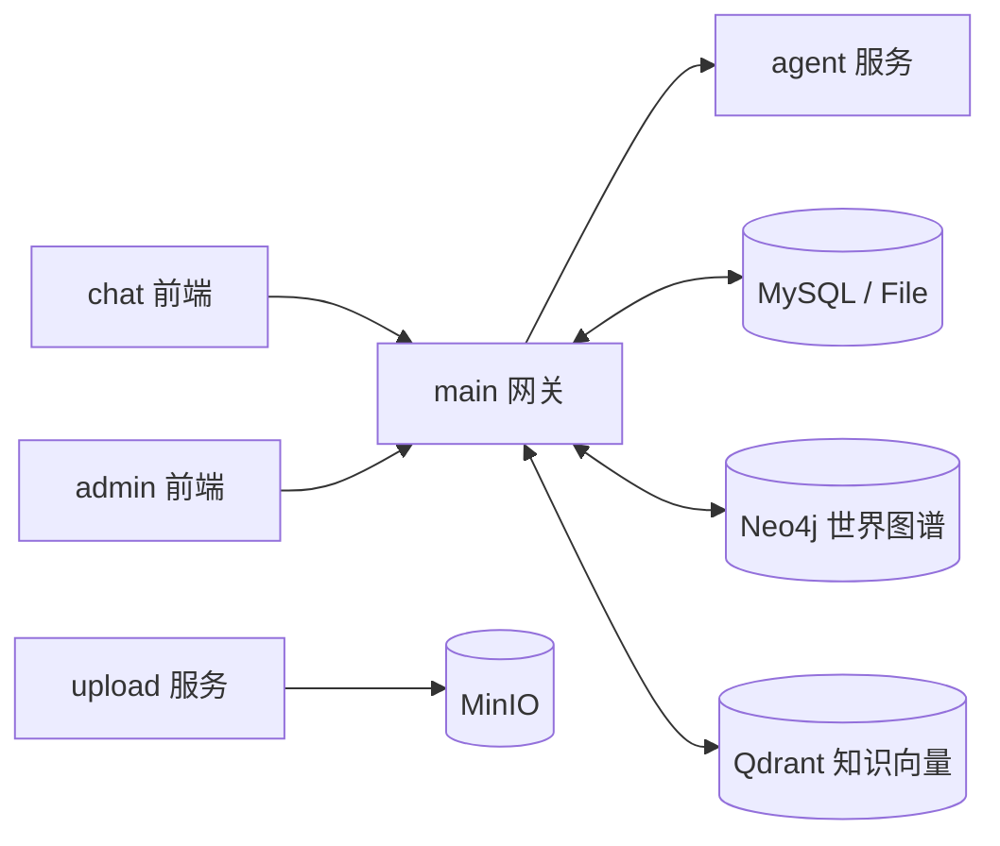
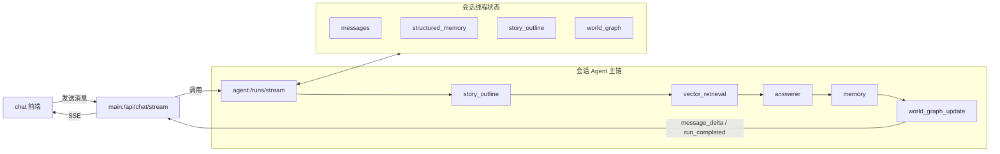

<p align="right">
  <a href="./README.md">中文</a> |
  <a href="./README.en.md">English</a>
</p>

<p align="center">
  
</p>

<h1 align="center">MyAiChat 拟真世界交互</h1>

<p align="center">
  
  
  
  
  
</p>

## 重要说明 
没有停止更新,最近在做0.3版本的重构.尽请期待0 0
缺人 缺人 缺人，我一个人实在忙不过来，莫名的感觉自己的时间太少了。有愿意加入的小伙伴可以联系：
[邮箱：q19946502@gmail.com](mailto:q19946502@gmail.com)  
[微信：zr19946502](https://weixin.qq.com/u/zr19946502)  
如果有什么想法或者bug也可以通过issue提交,我会尽快回复。
同时认可并感谢 LINUX DO 社区对开源交流与分享氛围的推动。
麻烦大家多多点赞，谢谢。
## 项目概览
MyAiChat 致力于实现更为拟真的世界交互API生成平台，为用户提供更沉浸的对话体验。将会持续的向三个方向的发展：
- 通过各类agent实现更为可控的小说/世界生成。
- 将场景中出现的人物节点都生成为独立智能体，实现自主交互，及世界演化。
- 实现多用户，多智能体的群组服务，支持用户之间的合作与互动。 例如跑团、合作完成任务等。智能体可以是dm也可以是扮演用户角色。

实现新的阅读方式，不再是冷冰冰的阅读，不再是单人阅读，而是用户参与到其中，每个角色都有自己的故事线。从传统线性模式改为变成树状结构阅读（你还记得古一老师给浩克讲时间线的故事嘛?）。
## 项目说明
MyAiChat 不是单体聊天页，而是一套围绕拟真对话搭建的完整工作台：
- `chat` 可以配置智能体，模型等信息。通过接口对接到个人/公司的软件中，或者进行在线对话。
- `main` 负责模型配置、会话管理、流式聊天编排、后台接口和数据持久化
- `agent` 负责回复生成、长短期记忆整理、故事草稿生成与统一世界图谱更新
- `upload` 负责图片上传与 MinIO 对象存储
- `admin` 提供后台管理前端，复用 `main` 暴露的 `/admin-api`
- `tools/console-manager` 提供中文控制台，便于本地一键起停与配置检查

<div align="center">
  
</div>

## 近期主线能力

以下能力已在最近几轮提交中进入主路径：

- Clerk 登录鉴权与用户级数据隔离
- OpenAI-compatible / Ollama 模型接入
- SSE 流式输出与事件归一化
- Agent 执行链：`story_outline -> vector_retrieval -> answerer -> memory -> world_graph_update`
- 提示词配置外置化，降低 agent 运行期冗余
- 固定长期记忆 / 短期记忆同步整理
- 会话级 `story outline` 结构化草稿生成与持久化
- 智能体世界图谱编辑器，支持时间线、关系类型、节点/边维护与自动布局
- 会话镜像世界图谱查看，聊天过程中可观察状态演进
- 智能体模板导入 / 导出
- 服务端统一处理聊天落库、故事草稿、同步记忆与统一世界图谱更新
- 主驱动从“结构化记忆推动”调整为“图谱驱动”：
  世界图谱成为下一轮剧情推进与状态延续的核心事实源，长短期记忆退回为压缩摘要与辅助上下文
- 文档导入、智能体生成任务、知识向量检索链路（`Qdrant`）与图谱存储（`Neo4j`）
- `file` / `mysql` 双存储驱动
- 独立上传服务（MinIO）
- 管理后台与中文控制台管理平台

## 近期主要工作内容
- 优化各类agent的性能，提高对话效率。
- 优化token用量，降低成本。
- 新增按故事线生成内容功能。（现在是按故事线续写）
- 优化整体界面，世界图谱展示方式，手机端适配等。
- 优化token统计。
- 对agent做加减法实现更多可配置的agent。

## 架构总览



- `chat` 负责对话界面与消息流展示。
- `main` 负责统一 API、会话落库、流式转发、检索编排与同步后处理。
- `agent` 负责故事草稿、正文生成、记忆整理与统一世界图谱更新。
- `upload` 负责文件上传，底层使用 `MinIO`。

### 会话 Agent 架构



- 主链：`chat -> main:/api/chat/stream -> story_outline -> GraphRAG 草稿辅助 -> 向量检索 -> answerer -> memory -> world_graph_update -> chat`
- `story_outline` 生成结构化 `story_draft + retrieval_query`，供正文和检索使用。
- GraphRAG 只辅助草稿，不直接进入正文上下文。
- 正文上下文使用：故事设定、长短期记忆、故事草稿、向量检索结果、最近一轮对话、当前输入。
- `memory` 每轮同步整理长期记忆和短期记忆。
- `world_graph_update` 在一次模型调用中同时完成两件事：
  把正文中实际发生的内容直接写入会话图谱，并演化正文没有直接写出的其它图谱部分。
- 正文中已经明确写出的对象、关系、事件以正文结果为准，不再单独进入第二次演化。
- 当前会话主路径已从“结构化记忆推动”调整为“图谱驱动”。
  长短期记忆用于压缩长期身份、近期状态和任务摘要；真正承载世界状态推进、事件时间线和关系变化的是世界图谱。
- 会话线程状态会持续保存 `messages / structured_memory / story_outline / world_graph`，下一轮对话优先复用。

## 项目结构

```text
.
├─ chat/                  # Vue 3 + Vite + TS 聊天前端
├─ main/                  # Node.js + Express 网关 / API / 后台接口
├─ agent/                 # Node.js + Express + LangGraph 智能体服务
├─ upload/                # Node.js 上传服务（MinIO）
├─ admin/                 # Vue 3 管理后台前端
├─ docs/                  # 补充设计与说明文档
├─ tools/console-manager/ # 中文控制台管理平台
├─ docker-compose.yml
└─ .env.example
```

## 运行要求

- Node.js：`^20.19.0` 或 `>=22.12.0`
- pnpm：`>=9`（推荐用于 `chat` / `admin`）
- `chat/admin` 包管理：`pnpm`
- `main/agent/upload` 包管理：`npm`
- Docker / Docker Compose（推荐用于联调）
- 可用的 Clerk 应用
- 若启用 `linux.do` 第三方登录，需要在 Clerk 中把它配置为外部身份提供方
- 若启用知识检索与世界图谱，需准备 `Qdrant` 与 `Neo4j`

## 本地启动

### 方式一：控制台管理平台（推荐）

1. 准备环境变量

```bash
cp .env.example .env
cp main/.env.example main/.env
cp chat/.env.example chat/.env
cp agent/.env.example agent/.env
cp upload/.env.example upload/.env
cp admin/.env.example admin/.env
```

2. 安装依赖

```bash
cd main && npm install
cd ../chat && pnpm install
cd ../agent && npm install
cd ../upload && npm install
cd ../admin && pnpm install
```

3. 初始化配置并启动控制台

```bash
npm run console:init-config
npm run console
```

控制台支持：

- 一键启动 `chat/main/agent/upload/admin`
- 向导式填写关键 `.env`
- 分组编辑配置并回写到实际文件
- 批量启动、停止、重启服务
- 配置校验与日志摘要查看

### 方式二：手动逐服务启动

```bash
cd main && npm install && npm run dev
cd chat && pnpm install && pnpm dev
cd upload && npm install && npm run dev
cd admin && pnpm install && pnpm dev
cd agent && npm install && npm run dev
```

若启用 MySQL 存储，先执行：

```bash
cd main && npm run migrate
```

## 本地开发默认地址

- chat：`http://localhost:5173`
- main：`http://127.0.0.1:3000`
- agent：`http://127.0.0.1:8000`
- upload：`http://127.0.0.1:3001`
- admin：`http://127.0.0.1:8081`
- admin-api：`http://127.0.0.1:3000/admin-api`

## Docker 启动

```bash
docker compose up --build
```

默认会拉起以下服务：

- `chat`：`8080`
- `main`：`3000`
- `admin`：`8081`
- `upload`：`3001`
- `agent`：容器内服务，默认 `8000`，不对宿主机直接暴露
- `mysql`：`3306`
- `minio`：`9000/9001`
- `neo4j`：`7474/7687`
- `qdrant`：`6333/6334`

## 常用开发命令

### chat

```bash
cd chat
pnpm dev
pnpm type-check
pnpm test:unit --run
pnpm test:e2e
pnpm build
pnpm lint
pnpm spell:check
```

### main

```bash
cd main
npm run dev
npm run migrate
npm run spell:check
```

### agent

```bash
cd agent
npm install
npm run dev
```

### upload

```bash
cd upload
npm run dev
```

### admin

```bash
cd admin
pnpm dev
pnpm build
pnpm typecheck
pnpm lint
```

### 控制台管理平台

```bash
npm run console
npm run console:start
npm run console:status
npm run console:stop
npm run console:restart
npm run console:install-env
npm run console:wizard-config
npm run console:config-check
npm run console:init-config
```

## 关键配置

### 根目录 `.env`

- `PORT`：`main` 服务端口
- `CHAT_PORT` / `ADMIN_PORT` / `UPLOAD_PORT`：Docker 暴露端口
- `CLERK_SECRET_KEY` / `CLERK_PUBLISHABLE_KEY` / `VITE_CLERK_PUBLISHABLE_KEY`：鉴权配置，`linux.do` 第三方登录仍通过这组 Clerk 配置生效
- `VITE_ADMIN_API_BASE_URL` / `ADMIN_API_BASE_URL`：后台前端与后台接口地址
- `JWT_SECRET` / `JWT_ALGO`：后台接口鉴权

### Clerk 接入 `linux.do`

1. 在 Clerk Dashboard 中启用 `linux.do` 外部身份提供方，并填写对应的 Client ID / Client Secret。
2. 将本地 `http://localhost:5173` 和生产前端域名加入 Clerk 的允许域名、登录回调地址与登出回调地址。
3. 保持当前前端“登录”按钮不变，用户仍通过 Clerk 弹窗完成登录，`linux.do` 入口由 Clerk 展示。
4. 登录成功后，`chat` 继续使用 Clerk token 访问 `main` 与 `upload`，无需新增项目内 OAuth 接口。
5. 若 Clerk 弹窗中未出现 `linux.do`，优先检查 provider 是否启用、回调域名是否匹配、前端是否使用了正确的 Clerk Publishable Key。

### `main/.env`

- `STORAGE_DRIVER`：`file` / `mysql`
- `AGENT_SERVICE_URL`：`main -> agent`
- `DB_*`：MySQL 连接参数
- `NEO4J_*`：世界图谱存储
- `QDRANT_*`：知识检索向量库
- `KNOWLEDGE_EMBEDDING_*`：知识文档 embedding 模型配置
- `ROBOT_IMPORT_MAX_FILE_SIZE_MB`：导入文档大小限制
- `ROBOT_GENERATION_CONCURRENCY`：智能体生成任务并发数

### `agent/.env`

- `AGENT_STORAGE_DRIVER`：`file` / `mysql`
- `DB_*`：启用 MySQL 时的连接参数
- `AGENT_FILE_STORE_DIR`：文件存储模式下的线程状态目录
- `AGENT_DEBUG_LOGS`：是否输出 agent 调试日志

### `upload/.env`

- `MINIO_*`：对象存储配置
- `UPLOAD_MAX_FILE_SIZE_MB`：上传大小限制

## 主要 API 入口

### `main`

- 模型配置：`/api/model-configs`、`/api/model-config`
- 能力与模型探测：`/api/models`、`/api/capabilities`
- 会话管理：`/api/sessions`
- 智能体管理：`/api/robots`
- 智能体生成任务：`/api/robots/generation-tasks`
- 世界图谱：`/api/robots/:id/world-graph/*`
- 流式聊天：`POST /api/chat/stream`
- 后台接口：`/admin-api/*`

### `agent`

- 健康检查：`GET /health`
- 流式运行：`POST /runs/stream`
- 结构化记忆：`POST /runs/memory`
- 世界图谱回写：`POST /runs/world-graph-writeback`
- 文档总结 / 生成辅助：`POST /runs/document-summary`

### `upload`

- 健康检查：`GET /health`
- 图片上传：`POST /api/upload/image`

## 调试建议

- 链路排查顺序：`agent /health` -> `main API` -> `chat SSE`
- 先用 `file` 模式排除数据库与外部依赖问题
- 世界图谱异常优先检查 `Neo4j` 连接和 `main` 日志
- 知识检索异常优先检查 `Qdrant`、`KNOWLEDGE_EMBEDDING_*` 与模型可用性
- 如果后台无法登录，优先确认 `main` 已完成后台种子初始化

## Star

<picture>
  <source media="(prefers-color-scheme: dark)" srcset="https://api.star-history.com/image?repos=zrbyhelp/MyAiChat&type=date&theme=dark&legend=top-left" />
  <source media="(prefers-color-scheme: light)" srcset="https://api.star-history.com/image?repos=zrbyhelp/MyAiChat&type=date&legend=top-left" />
  
</picture>
