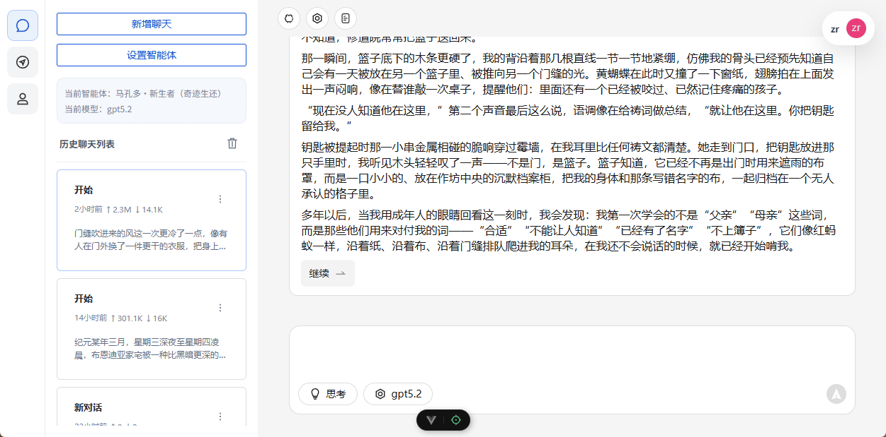
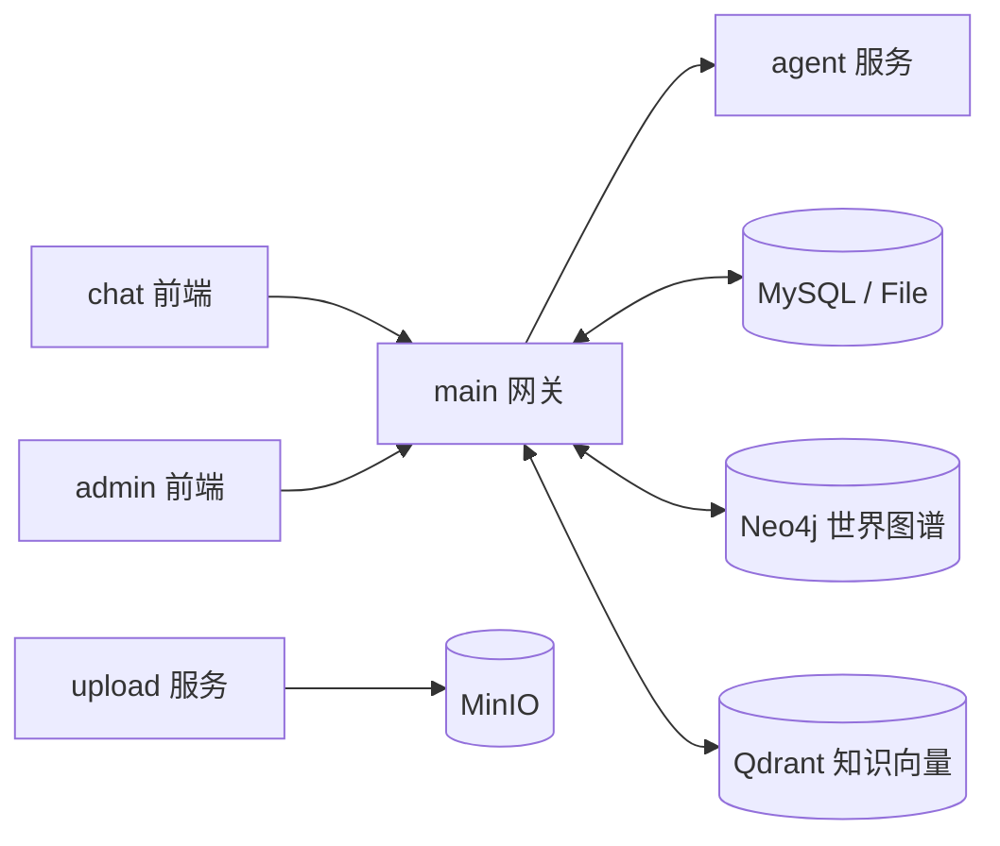
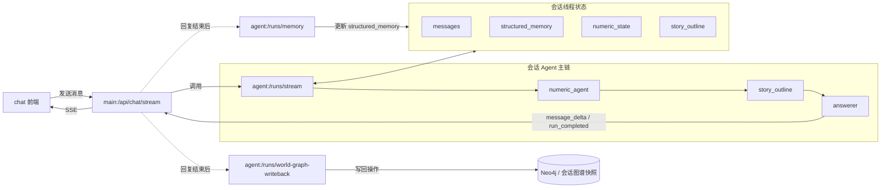

<p align="right">
  <a href="./README.zh-CN.md">中文</a> |
  <a href="./README.en.md">English</a>
</p>

<p align="center">
  
</p>

<h1 align="center">MyAiChat</h1>

<p align="center">
  面向聊天产品场景的多服务 AI 对话系统（Chat + Gateway + Agent + Upload + Admin）
</p>

<p align="center">
  
  
  
  
</p>

## 项目概览

MyAiChat 不是单体聊天页，而是一套围绕 AI 聊天产品搭建的完整工作台：

- `chat` 提供面向终端用户的 Vue 3 对话界面
- `main` 负责模型配置、会话管理、流式聊天编排、后台接口和数据持久化
- `agent` 负责多智能体推理、结构化记忆、故事梗概与世界图谱写回
- `upload` 负责图片上传与 MinIO 对象存储
- `admin` 提供后台管理前端，复用 `main` 暴露的 `/admin-api`
- `tools/console-manager` 提供中文控制台，便于本地一键起停与配置检查

<div align="center">
  
</div>

## 近期主线能力

以下能力已在最近几轮提交中进入主路径：

- Clerk 登录鉴权与用户级数据隔离
- OpenAI-compatible / Ollama 模型接入
- SSE 流式输出与事件归一化
- Agent 执行链：前台 `numeric -> story_outline -> answerer`，后台 `memory -> world_graph_writeback`
- 提示词配置外置化，降低 agent 运行期冗余
- 动态结构化记忆与可配置 Schema
- 会话级 `story outline` 生成与持久化
- 机器人世界图谱编辑器，支持时间线、关系类型、节点/边维护与自动布局
- 会话镜像世界图谱查看，聊天过程中可观察状态演进
- 智能体模板导入 / 导出
- 服务端统一处理聊天落库、故事梗概与世界图谱写回
- 文档导入、机器人生成任务、知识向量检索链路（`Qdrant`）与图谱存储（`Neo4j`）
- `file` / `mysql` 双存储驱动
- 独立上传服务（MinIO）
- 管理后台与中文控制台管理平台

## 架构总览



- `chat` 负责对话界面与消息流展示。
- `main` 负责统一 API、会话落库、流式转发和后台任务调度。
- `agent` 负责回复生成、记忆整理、故事梗概与图谱写回。
- `upload` 负责文件上传，底层使用 `MinIO`。

### 会话 Agent 架构



- 前台主链：`chat -> main:/api/chat/stream -> agent:/runs/stream -> numeric_agent -> story_outline -> answerer -> main -> chat`
- `numeric_agent` 先更新会话数值状态，供后续节点继续使用。
- `story_outline` 生成本轮内部故事梗概，不直接展示给用户，但会进入回答上下文。
- `answerer` 负责流式生成最终回复，`main` 接收后再转成 SSE 返回前端。
- 主回复结束后，`main` 会异步触发 `memory` 和 `world_graph_writeback` 两条后台链路。
- 会话线程状态会持续保存 `messages / structured_memory / numeric_state / story_outline`，下一轮对话优先复用。

## 项目结构

```text
.
├─ chat/                  # Vue 3 + Vite + TS 聊天前端
├─ main/                  # Node.js + Express 网关 / API / 后台接口
├─ agent/                 # Node.js + Express + LangGraph 智能体服务
├─ upload/                # Node.js 上传服务（MinIO）
├─ admin/                 # Vue 3 管理后台前端
├─ docs/                  # 补充设计与说明文档
├─ tools/console-manager/ # 中文控制台管理平台
├─ docker-compose.yml
└─ .env.example
```

## 运行要求

- Node.js：`^20.19.0` 或 `>=22.12.0`
- pnpm：`>=9`（推荐用于 `chat` / `admin`）
- `chat/admin` 包管理：`pnpm`
- `main/agent/upload` 包管理：`npm`
- Docker / Docker Compose（推荐用于联调）
- 可用的 Clerk 应用
- 若启用知识检索与世界图谱，需准备 `Qdrant` 与 `Neo4j`

## 本地启动

### 方式一：控制台管理平台（推荐）

1. 准备环境变量

```bash
cp .env.example .env
cp main/.env.example main/.env
cp chat/.env.example chat/.env
cp agent/.env.example agent/.env
cp upload/.env.example upload/.env
cp admin/.env.example admin/.env
```

2. 安装依赖

```bash
cd main && npm install
cd ../chat && pnpm install
cd ../agent && npm install
cd ../upload && npm install
cd ../admin && pnpm install
```

3. 初始化配置并启动控制台

```bash
npm run console:init-config
npm run console
```

控制台支持：

- 一键启动 `chat/main/agent/upload/admin`
- 向导式填写关键 `.env`
- 分组编辑配置并回写到实际文件
- 批量启动、停止、重启服务
- 配置校验与日志摘要查看

### 方式二：手动逐服务启动

```bash
cd main && npm install && npm run dev
cd chat && pnpm install && pnpm dev
cd upload && npm install && npm run dev
cd admin && pnpm install && pnpm dev
cd agent && npm install && npm run dev
```

若启用 MySQL 存储，先执行：

```bash
cd main && npm run migrate
```

## 本地开发默认地址

- chat：`http://localhost:5173`
- main：`http://127.0.0.1:3000`
- agent：`http://127.0.0.1:8000`
- upload：`http://127.0.0.1:3001`
- admin：`http://127.0.0.1:8081`
- admin-api：`http://127.0.0.1:3000/admin-api`

## Docker 启动

```bash
docker compose up --build
```

默认会拉起以下服务：

- `chat`：`8080`
- `main`：`3000`
- `admin`：`8081`
- `upload`：`3001`
- `agent`：容器内服务，默认 `8000`，不对宿主机直接暴露
- `mysql`：`3306`
- `minio`：`9000/9001`
- `neo4j`：`7474/7687`
- `qdrant`：`6333/6334`

## 常用开发命令

### chat

```bash
cd chat
pnpm dev
pnpm type-check
pnpm test:unit --run
pnpm test:e2e
pnpm build
pnpm lint
pnpm spell:check
```

### main

```bash
cd main
npm run dev
npm run migrate
npm run spell:check
```

### agent

```bash
cd agent
npm install
npm run dev
```

### upload

```bash
cd upload
npm run dev
```

### admin

```bash
cd admin
pnpm dev
pnpm build
pnpm typecheck
pnpm lint
```

### 控制台管理平台

```bash
npm run console
npm run console:start
npm run console:status
npm run console:stop
npm run console:restart
npm run console:install-env
npm run console:wizard-config
npm run console:config-check
npm run console:init-config
```

## 关键配置

### 根目录 `.env`

- `PORT`：`main` 服务端口
- `CHAT_PORT` / `ADMIN_PORT` / `UPLOAD_PORT`：Docker 暴露端口
- `CLERK_SECRET_KEY` / `CLERK_PUBLISHABLE_KEY` / `VITE_CLERK_PUBLISHABLE_KEY`：鉴权配置
- `VITE_ADMIN_API_BASE_URL` / `ADMIN_API_BASE_URL`：后台前端与后台接口地址
- `JWT_SECRET` / `JWT_ALGO`：后台接口鉴权

### `main/.env`

- `STORAGE_DRIVER`：`file` / `mysql`
- `AGENT_SERVICE_URL`：`main -> agent`
- `DB_*`：MySQL 连接参数
- `NEO4J_*`：世界图谱存储
- `QDRANT_*`：知识检索向量库
- `KNOWLEDGE_EMBEDDING_*`：知识文档 embedding 模型配置
- `ROBOT_IMPORT_MAX_FILE_SIZE_MB`：导入文档大小限制
- `ROBOT_GENERATION_CONCURRENCY`：机器人生成任务并发数

### `agent/.env`

- `AGENT_STORAGE_DRIVER`：`file` / `mysql`
- `DB_*`：启用 MySQL 时的连接参数
- `AGENT_FILE_STORE_DIR`：文件存储模式下的线程状态目录
- `AGENT_DEBUG_LOGS`：是否输出 agent 调试日志

### `upload/.env`

- `MINIO_*`：对象存储配置
- `UPLOAD_MAX_FILE_SIZE_MB`：上传大小限制

## 主要 API 入口

### `main`

- 模型配置：`/api/model-configs`、`/api/model-config`
- 能力与模型探测：`/api/models`、`/api/capabilities`
- 会话管理：`/api/sessions`
- 智能体管理：`/api/robots`
- 智能体生成任务：`/api/robots/generation-tasks`
- 世界图谱：`/api/robots/:id/world-graph/*`
- 流式聊天：`POST /api/chat/stream`
- 后台接口：`/admin-api/*`

### `agent`

- 健康检查：`GET /health`
- 流式运行：`POST /runs/stream`
- 结构化记忆：`POST /runs/memory`
- 世界图谱回写：`POST /runs/world-graph-writeback`
- 文档总结 / 生成辅助：`POST /runs/document-summary`

### `upload`

- 健康检查：`GET /health`
- 图片上传：`POST /api/upload/image`

## 调试建议

- 链路排查顺序：`agent /health` -> `main API` -> `chat SSE`
- 先用 `file` 模式排除数据库与外部依赖问题
- 世界图谱异常优先检查 `Neo4j` 连接和 `main` 日志
- 知识检索异常优先检查 `Qdrant`、`KNOWLEDGE_EMBEDDING_*` 与模型可用性
- 如果后台无法登录，优先确认 `main` 已完成后台种子初始化

## 相关文档

- [README.md](./README.md)
- [README.en.md](./README.en.md)
- [chat/README.md](./chat/README.md)
- [admin/README.md](./admin/README.md)
- [DATABASE_DOCKER_SETUP.zh-CN.md](./DATABASE_DOCKER_SETUP.zh-CN.md)
- [TASK_CHECKLIST.md](./TASK_CHECKLIST.md)
- [TASK_CHECKLIST.en.md](./TASK_CHECKLIST.en.md)
- [TASK_CHECKLIST.zh-CN.md](./TASK_CHECKLIST.zh-CN.md)
